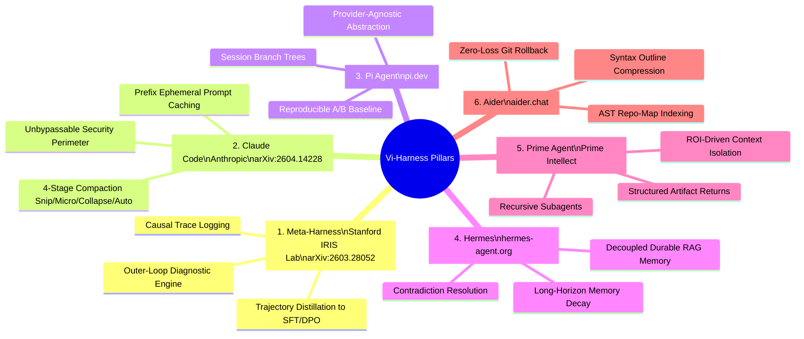
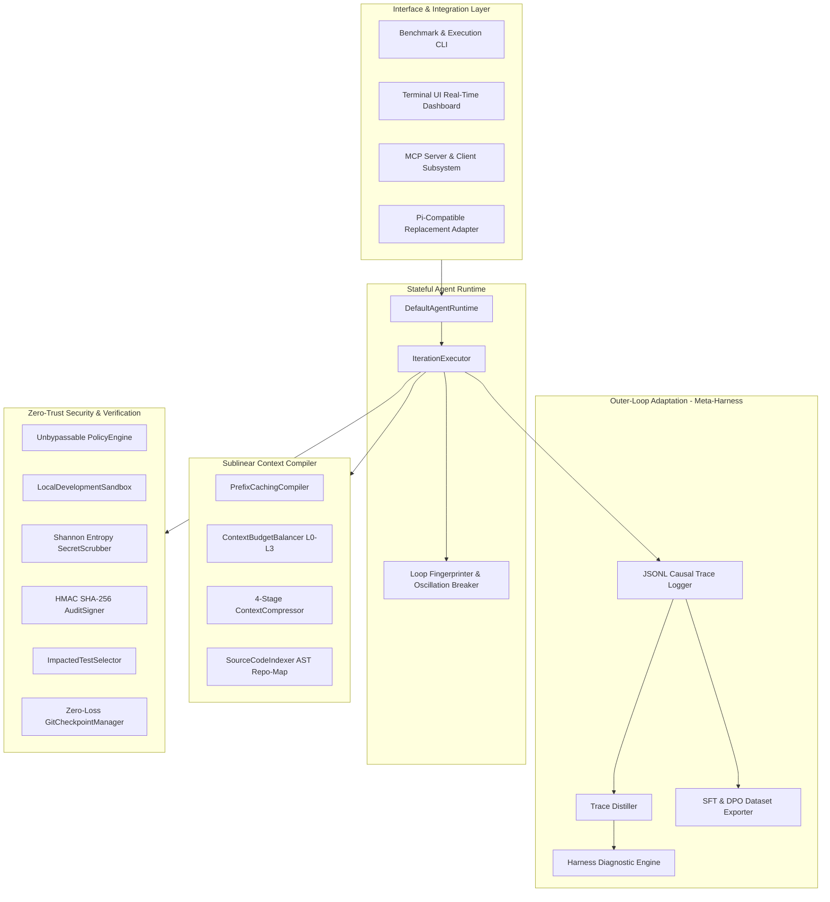
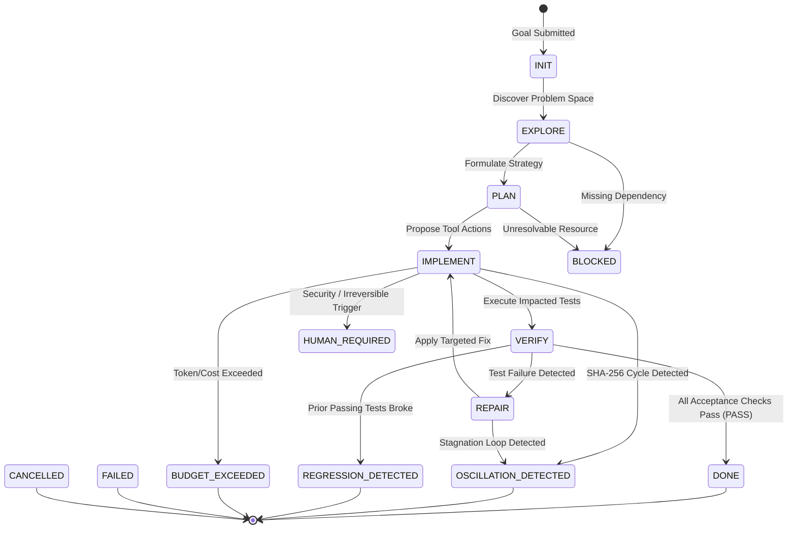
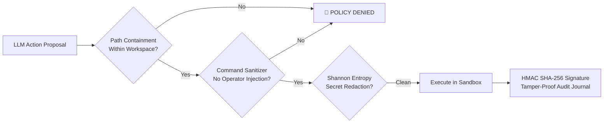

<div align="center">

# ⚡ Vi-Harness

### *Enterprise-Grade, Model-Agnostic Coding-Agent Runtime & Scientific Evaluation Harness*

[](https://www.typescriptlang.org/)
[](https://nodejs.org/)
[-brightgreen.svg?style=for-the-badge&logo=vitest)](./tests)
[](./docs/architecture/CONTEXT_ENGINEERING.md)
[](https://modelcontextprotocol.io/)
[](./LICENSE)

<br/>

```
  ██▒   █▓ ██▓        ██░ ██  ▄▄▄       ██▀███   ███▄    █ ▓█████   ██████   ██████ 
 ▓██░   █▒▓██▒       ▓██░ ██▒▒████▄    ▓██ ▒ ██▒ ██ ▀█   █ ▓█   ▀ ▒██    ▒ ▒██    ▒ 
  ▓██  █▒░▒██▒ ▒████ ▒██▀▀██░▒██  ▀█▄  ▓██ ░▄█ ▒▓██  ▀█ ██▒▒███   ░ ▓██▄   ░ ▓██▄   
   ▒██ █░░░██░ ░     ░▓█ ░██ ░██▄▄▄▄██ ▒██▀▀█▄  ▓██▒  ▐▌██▒▒▓█  ▄   ▒   ██▒  ▒   ██▒
    ▒▀█░  ░██░ ░     ░▓█▒░██▓ ▓█   ▓██▒░██▓ ▒██▒▒██░   ▓██░░▒████▒▒██████▒▒▒██████▒▒
    ░ ▐░  ░▓          ▒ ░░▒░▒ ▒▒   ▓▒█░░ ▒▓ ░▒▓░░ ▒░   ▒ ▒ ░░ ▒░ ░▒ ▒▓▒ ▒ ░▒ ▒▓▒ ▒ ░
    ░ ░░   ▒ ░        ▒ ░▒░ ░  ▒   ▒▒ ░  ░▒ ░ ▒░░ ░░   ░ ▒░ ░ ░  ░░ ░▒  ░ ░░ ░▒  ░ ░
      ░░   ▒ ░        ░  ░░ ░  ░   ▒     ░░   ░    ░   ░ ░    ░   ░  ░  ░  ░  ░  ░  
       ░   ░          ░  ░  ░      ░  ░   ░              ░    ░  ░      ░        ░  
      ░                                                                               
```

**[Theoretical Foundations](#-the-6-reference-pillars) • [System Architecture](#-visual-system-architecture) • [Context Engine](#-four-tier-context-engine-l0-l3) • [Benchmarks](#-empirical-benchmarks) • [Quickstart](#-quickstart) • [MCP Protocol](#-model-context-protocol-mcp) • [Documentation](#-documentation-index)**

</div>

---

## 🎯 Central Architectural Axiom

> ### **"The agent is not a persistent conversation. The agent is a stateful, evidence-driven state machine."**

Traditional LLM coding agents treat long-horizon software engineering as an accumulating multi-turn conversation. Over 20+ iterations, conversational history suffers from **context bloat, linear token cost inflation, attention dilution, and loss-in-the-middle degradation**.

**Vi-Harness** departs from conversational memory. It models autonomous software development as a **deterministic 14-phase state machine** governed by formal empirical verification evidence (compiler diagnostics, AST symbol graphs, test exit codes, and cryptographic audit journals).

```
   CONVERSATIONAL CODING AGENTS (Flawed)
   [Turn 1] -> [Turn 2] -> [Turn 3] -> ... -> [Turn 100]  ===> 🛑 Token Explosion (O(N)), Lost-in-the-Middle
   
   VI-HARNESS STATE MACHINE RUNTIME (Sublinear O(log N))
   ┌─────────┐     Proposals     ┌──────────────────┐     Evidence      ┌─────────┐
   │  Model  │ ───────────────>  │ Stateful Runtime │ <──────────────── │ Sandbox │
   └─────────┘                   └──────────────────┘                   └─────────┘
        ▲                                 │                                  │
        └─────── Context Compiler ────────┴──────── Policy Sandbox ──────────┘
```

---

## 🔬 The 6 Reference Pillars

Vi-Harness synthesizes architectural advances from the foremost research papers and production harnesses in AI engineering:



1. **Meta-Harness (Stanford IRIS Lab, [arXiv:2603.28052](https://arxiv.org/abs/2603.28052))**: Structured JSONL causal trace logging (`.vi-traces/`), automated outer-loop harness diagnostic distillation, and self-correction trajectory training export.
2. **Claude Code (Anthropic, [arXiv:2604.14228](https://arxiv.org/abs/2604.14228))**: 4-stage progressive compaction pipeline (`Snip` $\to$ `Micro-compact` $\to$ `Collapse` $\to$ `Auto-compact`) with strict domain invariant preservation (`mustPreserve = true`) and unbypassable security rules.
3. **Pi ([pi.dev](https://pi.dev))**: Clean provider abstraction layer, reproducible session branching, and direct A/B comparative benchmarking.
4. **Hermes ([hermes-agent.org](https://hermes-agent.org))**: Long-horizon durable memory system decoupled from conversation transcripts with automatic decay and contradiction resolution.
5. **Prime Agent ([Prime Intellect](https://github.com/PrimeIntellect-ai/prime-agent))**: Recursive subagent swarm with strict token allowances and artifact-based parent return contracts (zero transcript leakage).
6. **Aider ([aider.chat](https://aider.chat))**: AST repository symbol mapping, syntax outline compression, and zero-loss git rollback preserving uncommitted user modifications.

---

## 🏗️ Visual System Architecture



---

## 🔄 The 14 Canonical Agent Phases

Vi-Harness replaces unbounded conversational prompt chaining with a formal finite state machine:



---

## 📚 Four-Tier Context Engine (L0 - L3)

Vi-Harness categorizes all agent information into four isolated tiers, dynamically balanced per phase:

| Tier | Tier Name | Persistence | Allocation | Contents & Lifecycle |
| :---: | :--- | :--- | :---: | :--- |
| **`L0`** | **Hot State** | Current Turn | **35-45%** | Active goal, modified file diffs, compiler error diagnostics, tool results. |
| **`L1`** | **Working Memory** | Active Task | **20-30%** | Step-by-step checklist, active hypothesis, recent design decisions. |
| **`L2`** | **Episodic History** | Session | **10-15%** | Condensed milestones of prior attempts, rolled-back branches, failed hypotheses. |
| **`L3`** | **Repository Knowledge** | Permanent | **20-40%** | Architecture rules, coding guidelines, AST Repo-Map symbol graph. |

### 4-Stage Progressive Compaction Pipeline
```
[Raw Tool Output / Logs]
       │
       ▼  Stage 1: SNIP (Head/Tail truncation of large outputs >2KB)
[Snipped Diagnostics]
       │
       ▼  Stage 2: MICRO-COMPACT (Strip formatting whitespace, collapse redundant tokens)
[Condensed Context]
       │
       ▼  Stage 3: COLLAPSE (Fold completed sub-trajectories into single-line milestones)
[Milestone Summary]
       │
       ▼  Stage 4: AUTO-COMPACT (Triggered when context >75% budget; preserves domain invariants)
[Final Invariant-Preserved Prompt]
```

---

## 📊 Empirical Benchmarks

### 1. Context Scaling Benchmark (`npm run benchmark:context`)
Evaluated across **10, 25, 50, and 100-iteration** horizons with noisy logs, repeated tool outputs, and critical domain invariants:

```
======================================================================
 VI-HARNESS CONTEXT-EFFICIENCY BENCHMARK RESULTS
======================================================================
 Strategy             | 10 Iters   | 25 Iters   | 50 Iters   | 100 Iters  | Memory Retention
---------------------+------------+------------+------------+------------+------------------
 Naive Accumulation  | 8,671 tok  | 25,762 tok | 48,134 tok | 89,870 tok | 100.0% (Bloat)
 Pi-Style Compaction | 727 tok    | 2,873 tok  | 3,294 tok  | 2,221 tok  | 0.0%   (Lossy)
 Vi-Harness Compiler | 1,502 tok  | 3,410 tok  | 6,474 tok  | 9,995 tok  | 100.0% (Retained)
======================================================================
 Total Token Savings vs Naive Accumulation : 85.3% REDUCTION
 Critical Domain Invariant Retention       : 100.0% ZERO INFORMATION LOSS
 Growth Rate Complexity                    : Sublinear O(log N)
```

---

## 🖥️ Terminal UI (TUI) Dashboard

Vi-Harness includes a real-time high-density ASCII/ANSI dashboard for live agent telemetry:

```
============================================================================
 VI-HARNESS AGENTIC DASHBOARD | Exec: 0195029a-7c91 | Turn: #4
 Model: openai/gpt-4o | Phase: [IMPLEMENT]
----------------------------------------------------------------------------
 Phase Pipeline:  EXPLORE  ->  PLAN  -> [>> IMPLEMENT <<] ->  VERIFY  ->  DONE 
----------------------------------------------------------------------------
 Context Hierarchy Allocations (L0 - L3):
   L0_HOT          : [################----]  78% (3120/4000 tokens)
   L1_WORKING      : [############--------]  60% (1500/2500 tokens)
   L2_EPISODIC     : [########------------]  40% (400/1000 tokens)
   L3_REPOSITORY   : [####################] 100% (2500/2500 tokens)
----------------------------------------------------------------------------
 Telemetry: Tokens: 7,520 (Prompt: 7,000 | Output: 520 | Cache Hit: 78%)
 Cost Accrued: $0.0245 USD
----------------------------------------------------------------------------
 Recent Tool Executions:
   ✓ [SUCCESS] read_file            (34ms)
   ✓ [SUCCESS] ast_index_symbols    (112ms)
   ✓ [SUCCESS] write_file           (18ms)
----------------------------------------------------------------------------
 State Hash: 8f4e2a1b9c3d0e7f... | Health: ✓ NOMINAL (0 Oscillations)
============================================================================
```

---

## 🔌 Model Context Protocol (MCP)

Vi-Harness provides native, zero-config interoperability with the **Model Context Protocol (MCP)**:

### 1. Vi-Harness as an MCP Server
Expose all Vi-Harness tools, context graphs, and verification engines to **Cursor, Claude Desktop, VS Code, and JetBrains**:

```typescript
import { McpServer, DefaultToolRegistry, ReadFileTool, WriteFileTool, UuidV7IdFactory } from 'vi-harness';

const idFactory = new UuidV7IdFactory();
const registry = new DefaultToolRegistry();
registry.register(new ReadFileTool(idFactory));
registry.register(new WriteFileTool(idFactory));

const server = new McpServer({
  serverName: 'vi-harness-mcp',
  toolRegistry: registry,
});

// Responds to JSON-RPC 2.0 requests: tools/list, tools/call, resources/read
const response = await server.handleRequest({
  jsonrpc: '2.0',
  id: 1,
  method: 'tools/list',
});
```

### 2. Vi-Harness as an MCP Client
Connect the Vi-Harness runtime to external MCP servers (Postgres, GitHub, Slack) with automatic policy sandboxing:

```typescript
import { McpClientAdapter, DefaultToolRegistry, UuidV7IdFactory } from 'vi-harness';

const client = new McpClientAdapter({
  serverName: 'github',
  transport: mySseOrStdioTransport,
  toolRegistry: localRegistry,
  idFactory: new UuidV7IdFactory(),
});

// Auto-discovers and registers external tools as 'mcp_github_<tool_name>'
const registeredTools = await client.syncTools();
```

---

## 🛡️ Enterprise Zero-Trust Security



- **Unbypassable Policy Engine**: Every proposed action passes through pre-flight policy evaluation with zero bypass flags.
- **Shannon Entropy Secret Scrubbing**: Redacts high-entropy keys ($-\sum p_i \log_2 p_i \ge 4.5$) before writing to traces or context.
- **Cryptographic Audit Signing**: Generates HMAC SHA-256 signatures for every state checkpoint and execution journal.
- **Zero-Loss Git Rollback**: Restores agent modifications while preserving uncommitted user changes.

---

## 🚀 Quickstart

### Prerequisites
- **Node.js**: `>= 20.0.0`
- **npm**: `>= 10.0.0`
- **Git**: `>= 2.30.0`

### Installation
```bash
git clone https://github.com/vfcarida/Vi-Harness.git
cd Vi-Harness
npm install
```

### Build & Typecheck
```bash
npm run build       # Compiles strict TypeScript to dist/
npm run typecheck   # Typechecks whole repository with zero errors
npm run lint        # Runs ESLint code-quality checks
```

### Run Tests (601 Tests, 100% Passing)
```bash
npm test            # Runs full Vitest suite (Unit, Integration, Security, Benchmarks)
npm run test:unit   # Runs unit tests only
npm run test:int    # Runs integration tests only
```

### Run Benchmarks
```bash
npm run benchmark:context   # Context scaling efficiency benchmark
npm run benchmark           # 7-Task canonical SWE evaluation suite
```

---

## 💻 Programmatic Usage

```typescript
import {
  DefaultAgentRuntime,
  DefaultContextCompiler,
  DefaultToolRegistry,
  LocalDevelopmentSandbox,
  DefaultPolicyEngine,
  OpenAICompatibleProvider,
  DefaultGitManager,
  UuidV7IdFactory,
  SystemClock,
} from 'vi-harness';

// 1. Initialize core services
const idFactory = new UuidV7IdFactory();
const clock = new SystemClock();
const sandbox = new LocalDevelopmentSandbox({ workspaceRoot: process.cwd() });
const policyEngine = new DefaultPolicyEngine();
const toolRegistry = new DefaultToolRegistry();

// 2. Configure model provider
const modelProvider = new OpenAICompatibleProvider({
  providerId: 'openai',
  apiKey: process.env.OPENAI_API_KEY!,
  baseUrl: 'https://api.openai.com/v1',
  models: ['gpt-4o', 'gpt-4o-mini'],
});

// 3. Instantiate and run autonomous agent
const runtime = new DefaultAgentRuntime({
  toolRegistry,
  policyEngine,
  sandbox,
  modelProvider,
  clock,
  idFactory,
});

const result = await runtime.execute({
  goal: 'Implement HMAC authentication middleware with unit tests.',
  maxIterations: 20,
});

console.log(`Execution ended in phase: [${result.finalPhase}] with success: ${result.isSuccess}`);
```

---

## 📁 Repository Structure

```
Vi-Harness/
├── docs/                   # Complete architectural, audit, and research documentation
│   ├── architecture/       # Current & target architecture, ADRs, module specifications
│   │   ├── CURRENT_ARCHITECTURE.md
│   │   ├── TARGET_ARCHITECTURE.md
│   │   └── adr/            # 7 Architecture Decision Records
│   ├── audit/              # Traceability matrix, baseline reports, verification results
│   │   ├── TRACEABILITY_MATRIX.md
│   │   └── VERIFICATION_REPORT.md
│   ├── research/           # Literature reviews, reference matrix, comparative analysis
│   │   ├── RESEARCH_REPORT.md
│   │   └── REFERENCE_MATRIX.md
│   ├── security/           # Threat model, STRIDE analysis, OWASP LLM mitigations
│   │   └── THREAT_MODEL.md
│   └── testing/            # Test strategy, pyramid breakdown, benchmark protocols
│       └── TEST_STRATEGY.md
├── src/
│   ├── cli/                # Benchmark and context evaluation CLI tools
│   ├── core/               # Domain interfaces, state machine, domain models (Zero Dependencies)
│   ├── di/                 # Dependency injection container and modules
│   ├── infra/              # Infrastructure (Compilers, MCP, TUI, Security, Tools, Telemetry)
│   └── runtime/            # State machine iteration loop and runtime engine
└── tests/
    ├── fixtures/           # Benchmark and reproduction workspaces
    ├── integration/        # End-to-end multi-turn workflows and real git tests
    └── unit/               # Domain, compiler, security, MCP, and tool unit tests
```

---

## 📖 Documentation Index

- 📐 **[Current Architecture Specification](./docs/architecture/CURRENT_ARCHITECTURE.md)**
- 🎯 **[Target Architecture & Invariants](./docs/architecture/TARGET_ARCHITECTURE.md)**
- 🔬 **[Research Report & Literature Review](./docs/research/RESEARCH_REPORT.md)**
- 📚 **[Authoritative Reference Matrix](./docs/research/REFERENCE_MATRIX.md)**
- 🛡️ **[Comprehensive Threat Model](./docs/security/THREAT_MODEL.md)**
- 🧪 **[Test Strategy & Pyramid](./docs/testing/TEST_STRATEGY.md)**
- 🔗 **[End-to-End Traceability Matrix](./docs/audit/TRACEABILITY_MATRIX.md)**
- 📋 **[Clean-Room Verification Report](./docs/audit/VERIFICATION_REPORT.md)**

---

## 📜 Citation

If you use Vi-Harness in your research, evaluations, or software engineering projects, please cite:

```bibtex
@software{vi_harness_2026,
  author = {Vi-Harness Contributors},
  title = {Vi-Harness: Enterprise-Grade, Model-Agnostic Coding-Agent Runtime and Harness},
  year = {2026},
  url = {https://github.com/vfcarida/Vi-Harness},
  version = {0.4.0}
}
```

---

## 📄 License

Vi-Harness is licensed under the **[MIT License](./LICENSE)**.
