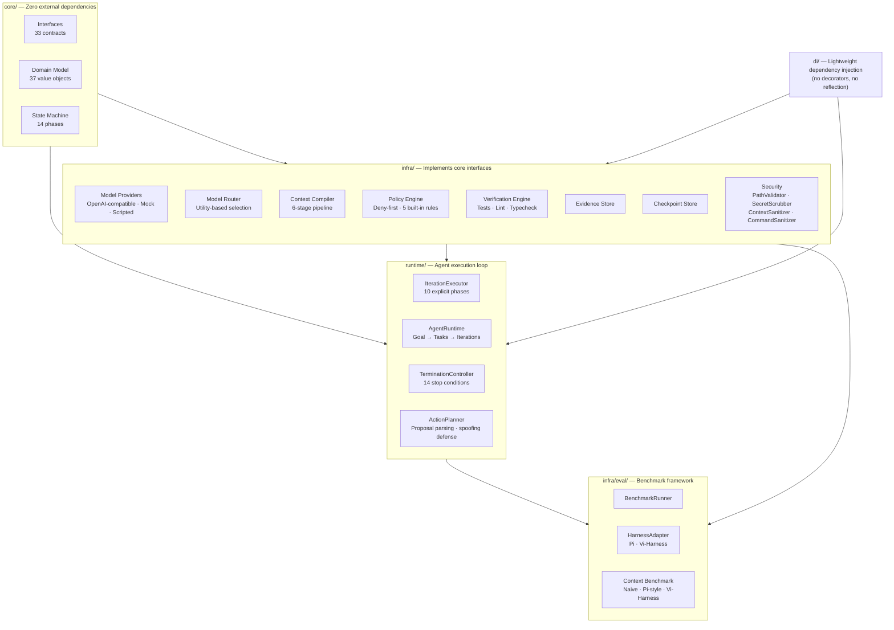
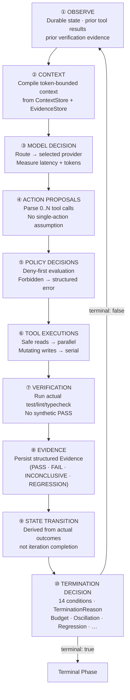
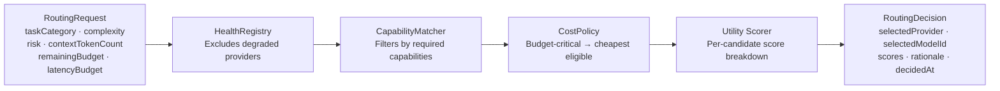
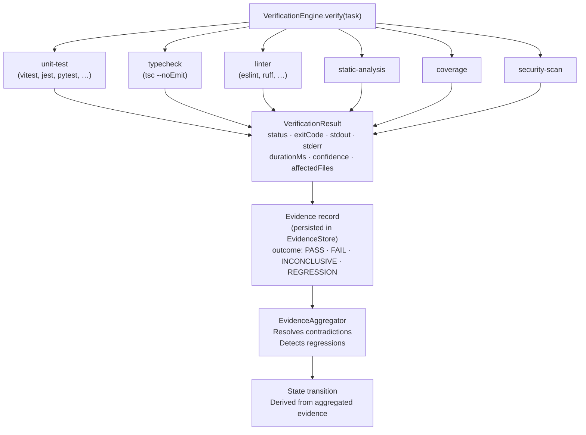
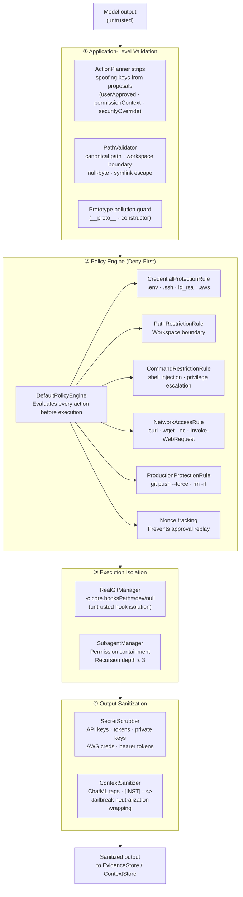

# Vi-Harness

> A model-agnostic coding-agent harness built around a deterministic, evidence-driven state machine.

**"The agent is not a persistent conversation. The agent is a stateful, evidence-driven state machine."**

[](https://github.com/vfcarida/Vi-Harness/actions/workflows/ci.yml)
[](https://github.com/vfcarida/Vi-Harness/actions/workflows/integration.yml)
[](LICENSE)
[](package.json)
[](tsconfig.json)

---

## Architecture Overview



---

## Why Vi-Harness Exists

Most coding-agent research controls for the model but does not control for the harness.

A harness determines:

- how context is assembled for each model call
- whether model proposals are validated before execution
- what constitutes task completion
- when to stop, and why

Swapping the model while keeping the harness constant measures model quality.  
Swapping the harness while keeping the model constant measures harness quality.

Vi-Harness was built to be the second kind of experiment.

---

## Problem Statement

Conversation-accumulation harnesses have three structural problems:

| Problem | Consequence |
|---|---|
| **Linear context growth** — raw tool outputs appended to message history | Context fills; early instructions are truncated; model reasons over stale data |
| **Implicit termination** — turn limits or LLM stop tokens | No distinction between oscillation, regression, budget exhaustion, and genuine completion |
| **Unverified success** — model declares "task complete" | Benchmark passes even when tests do not exist or do not pass |

These are not model limitations. They are harness limitations.

---

## Design Principles

1. **The model proposes; the runtime decides.** Every tool call passes through a policy engine before execution. The model can never grant itself permissions.

2. **Context is compiled, not accumulated.** Each iteration constructs a token-bounded context window from structured objects. Stale observations do not survive to the next iteration by default.

3. **Completion is evidence-driven.** Success requires empirical verification results (exit codes, test counts, typecheck output). A model statement cannot constitute evidence.

4. **Stop conditions live outside the LLM.** The `TerminationController` evaluates 14 conditions without asking the model: budget exhaustion, oscillation, exact repetition, regression detection, and more.

5. **State transitions are auditable.** Every phase change is an immutable `StateTransition` record carrying the triggering event, prior phase, and evidence IDs. The LLM never writes directly to the state machine.

6. **Security is layered, not prompt-based.** Application-level validation, a deny-first policy engine, output sanitization, and process isolation all operate independently of model behavior.

---

## Architecture

### Layer Dependency Rules

```
Runtime → Infrastructure → Core
                              ↑
              (all arrows point inward only)
```

**`core/` has zero external dependencies.** Infrastructure implements core interfaces. The DI container wires them together. Nothing in `runtime/` or `infra/` is imported by `core/`.

### Module Map

| Layer | Path | Responsibility |
|---|---|---|
| **Core — Types** | `src/core/types/` | Branded identifiers (`GoalId`, `TaskId`, `EvidenceId`, …) |
| **Core — Model** | `src/core/model/` | 37 immutable value objects (Goal, AgentState, Evidence, ContextObject, …) |
| **Core — Interfaces** | `src/core/interfaces/` | 33 abstract contracts — the only coupling point between layers |
| **Core — State Machine** | `src/core/state-machine/` | 14-phase deterministic state machine |
| **Infra — Providers** | `src/infra/model/` | `OpenAICompatibleProvider`, `MockModelProvider`, `ScriptedModelProvider` |
| **Infra — Router** | `src/infra/router/` | `UtilityModelRouter` — cost/capability/risk scoring |
| **Infra — Compiler** | `src/infra/compiler/` | `DefaultContextCompiler` — 6-stage compilation pipeline |
| **Infra — Security** | `src/infra/security/` | `PathValidator`, `SecretScrubber`, `ContextSanitizer`, `DefaultPolicyEngine` |
| **Infra — Verification** | `src/infra/verification/` | `DefaultVerificationEngine`, `AcceptanceEvaluator` |
| **Infra — Git** | `src/infra/git/` | Baseline capture, delta tracking, rollback, hook isolation |
| **Infra — Memory** | `src/infra/memory/` | `InMemoryMemoryStore` — Candidate → Active → Stale lifecycle |
| **Infra — Eval** | `src/infra/eval/` | `DefaultBenchmarkRunner`, `ViHarnessAdapterRunner`, `PiHarnessAdapterRunner` |
| **Runtime** | `src/runtime/` | `DefaultAgentRuntime`, `IterationExecutor`, `TerminationController`, `ActionPlanner` |
| **DI** | `src/di/` | `Container`, `Tokens`, `DefaultModule` — no decorators, no reflection |

---

## Agent Loop

Each iteration is 10 explicit, sequenced phases:



**Key property:** Phases ④–⑦ are not guaranteed to execute every iteration. If the model emits no tool calls, the loop records that observation and advances directly to ⑧–⑩. The runtime never injects a default action.

---

## Context Architecture

Context is assembled fresh each iteration from typed, scored objects — not appended to a message list.

```mermaid
graph LR
    subgraph Tiers
        L0["L0 HOT\nCurrent task · active files\ncurrent hypothesis · current failure"]
        L1["L1 WORKING\nActive plan · recent decisions\nrecent evidence · repair history"]
        L2["L2 EPISODIC\nPrior attempts · failed approaches\nprevious debugging trajectories"]
        L3["L3 REPOSITORY\nArchitecture facts · domain constraints\ncoding standards · permanent decisions"]
    end

    subgraph Pipeline ["6-Stage Compilation Pipeline"]
        R1[1. Retrieval] --> R2[2. Deduplication] --> R3[3. Ranking]
        R3 --> R4[4. Progressive Compression] --> R5[5. Validation] --> R6[6. Assembly]
    end

    Tiers --> Pipeline

    subgraph Invariants ["Mandatory Preservations (never auto-discarded)"]
        I1[USER_INSTRUCTION]
        I2[SECURITY_RULE]
        I3[ARCHITECTURE_FACT]
        I4[REGRESSION evidence]
        I5[Approved constraints]
    end

    R5 -->|"Enforces"| Invariants
```



### Compilation metrics (emitted every iteration)

```typescript
interface CompilationMetrics {
  inputObjectCount: number;
  tokensBefore:     number;
  tokensAfter:      number;
  compressionRatio: number;  // (before - after) / before
  retainedCount:    number;
  omittedCount:     number;
  mandatoryRetainedCount: number;
  durationMs:       number;
}
```

Context objects carry explicit importance (0–1), confidence (0–1), tier, scope, and dependency edges. The ranker uses a weighted scoring model:

| Weight | Factor |
|---|---|
| 30% | Importance score |
| 25% | Dependency coverage |
| 20% | Verification relevance |
| 15% | Failure relevance |
| 10% | Recency |
| 5% | Token cost penalty |

---

## Model Routing

The `UtilityModelRouter` selects a provider per-iteration based on task characteristics, not a fixed model assignment.



### Built-in routing rules

| Rule | Condition | Effect |
|---|---|---|
| `LOW_COMPLEXITY_CHEAP` | Summarization, classification | Prefer lowest-cost capable model |
| `HIGH_COMPLEXITY_REASONING` | Architecture, security review, bug fix | Require reasoning-capable model |
| `HIGH_RISK_APPROVED` | Risk = CRITICAL | Require explicit approval |
| `REPETITIVE_SMALL` | Same category, N+ iterations | Downgrade to cheaper model |
| `LONG_CONTEXT_REQUIRED` | Token count near limit | Require long-context model |
| `UNHEALTHY_EXCLUDED` | Provider error rate elevated | Exclude from candidates |
| `BUDGET_CRITICAL_LOW_COST` | Remaining budget < threshold | Force cheapest model |

---

## Verification and Evidence

The agent does not self-assess. It verifies through external process execution.



**Invariants enforced by the implementation:**

- A verification check with a missing command produces `INCONCLUSIVE`, never `PASS`.
- A previously-passing check that now fails produces `REGRESSION`, triggering `REGRESSION_FOUND` event and transitioning to `REGRESSION_DETECTED`.
- The `AcceptanceEvaluator` applies an explicit `AcceptancePolicy` (configurable pass-rate threshold, required check categories) before marking a goal `DONE`.

---

## Security

Vi-Harness treats model output as an untrusted proposal at every layer.



**Explicit limitation:** Vi-Harness does not provide kernel-level OS isolation. For production deployments running untrusted test suites, wrap the agent process in a container, gVisor, or Firecracker environment.

---

## Current Status

| Component | Status | Notes |
|---|---|---|
| Core domain model (37 value objects) | ✅ **IMPLEMENTED** | Stable, fully typed, zero external deps |
| 33 core interfaces | ✅ **IMPLEMENTED** | All implemented in `infra/` |
| 14-phase state machine | ✅ **IMPLEMENTED** | Deterministic, auditable transitions |
| `IterationExecutor` (10 phases) | ✅ **IMPLEMENTED** | Multi-tool-call, structured errors |
| `DefaultAgentRuntime` | ✅ **IMPLEMENTED** | Goal → Task → Iteration loop |
| `TerminationController` | ✅ **IMPLEMENTED** | 14 stop conditions, trajectory fingerprinting |
| `DefaultContextCompiler` (6 stages) | ✅ **IMPLEMENTED** | Compression, deduplication, invariant pinning |
| `UtilityModelRouter` | ✅ **IMPLEMENTED** | 7 policy rules, health registry, cost policy |
| `OpenAICompatibleProvider` | ✅ **IMPLEMENTED** | Works with any OpenAI-API-compatible endpoint |
| `DefaultPolicyEngine` + 5 rules | ✅ **IMPLEMENTED** | Deny-first, nonce-tracked approvals |
| `PathValidator` + `SecretScrubber` | ✅ **IMPLEMENTED** | 16 attack vectors hardened, regression tested |
| `DefaultVerificationEngine` | ✅ **IMPLEMENTED** | Multi-check, regression detection, no synthetic PASS |
| `RealGitManager` | ✅ **IMPLEMENTED** | Baseline capture, delta, rollback, hook isolation |
| `DefaultBenchmarkRunner` | ✅ **IMPLEMENTED** | Repeated runs, mean/median/p95, per-run records |
| `ViHarnessAdapterRunner` | ✅ **IMPLEMENTED** | Pi-compatible interface for benchmark comparison |
| `PiHarnessAdapterRunner` | ✅ **IMPLEMENTED** | Adapter wrapper for Pi harness |
| Context-efficiency benchmark | ✅ **IMPLEMENTED** | Naive vs Pi-style vs Vi-Harness, 10–100 iteration trajectories |
| Red-team regression suite | ✅ **IMPLEMENTED** | 16 attack vectors, all passing |
| `MockModelProvider` + `ScriptedModelProvider` | ✅ **IMPLEMENTED** | Deterministic, no API keys required for tests |
| Anthropic provider | 🔬 **EXPERIMENTAL** | Not yet wired to `OpenAICompatibleProvider` |
| Google Gemini provider | 📋 **PLANNED** | Requires native streaming adapter |
| Live Pi vs Vi-Harness benchmark results | 📋 **PLANNED** | See [Benchmark section](#benchmarking-pi-vs-vi-harness) |
| Persistent context store (SQLite/Redis) | 📋 **PLANNED** | Currently in-memory only |
| IDE integration | 📋 **PLANNED** | Language Server Protocol adapter |
| Human escalation UI | 📋 **PLANNED** | `HUMAN_REQUIRED` phase reached but no UI |

---

## Quick Start

**Requirements:** Node.js ≥ 20, Git.

```bash
# Clone and install
git clone https://github.com/vfcarida/Vi-Harness.git
cd Vi-Harness
npm ci

# Type-check
npm run typecheck

# Lint
npm run lint

# Unit tests (no secrets required)
npm run test:unit

# Integration tests (real Git, mocked models)
npm run test:integration

# Build
npm run build
```

---

## Example: Runtime Flow

The following shows the structure of a single agent execution. No real API calls are made — `ScriptedModelProvider` returns predetermined responses in tests.

```typescript
import { DefaultAgentRuntime } from './src/runtime/default-agent-runtime.js';
import { createDefaultContainer } from './src/di/default-module.js';
import type { Goal } from './src/core/model/goal.js';

// 1. Wire dependencies
const container = createDefaultContainer({
  provider: myOpenAICompatibleProvider,
  workingDirectory: '/path/to/repo',
});

// 2. Define goal with explicit constraints
const goal: Goal = {
  id: idFactory.createGoalId(),
  description: 'Fix the failing test in src/parser.ts and ensure all tests pass',
  constraints: {
    maxIterations: 20,
    maxCostDollars: 2.0,
    maxDurationMs: 10 * 60 * 1000,  // 10 minutes
    maxRepairAttempts: 5,
    maxNoProgressIterations: 3,
    requireVerification: true,
  },
  status: GoalStatus.PENDING,
  createdAt: new Date(),
  updatedAt: new Date(),
  metadata: {},
};

// 3. Execute — the runtime handles the iteration loop
const runtime = container.get(TOKENS.AgentRuntime);
const result = await runtime.execute(goal);

// 4. Result is derived from empirical verification, not model self-report
console.log(result.terminationReason);  // 'SUCCESS' | 'MAX_ITERATIONS' | 'REGRESSION' | …
console.log(result.iterationCount);
console.log(result.totalCostDollars);
console.log(result.finalDiff);          // Unified git patch of agent-owned changes
```

### Iteration trace (single iteration, abbreviated)

```
[IterationExecutor] Phase 1/10: OBSERVE  — state=EXPLORE iter=3 priorResults=2
[IterationExecutor] Phase 2/10: CONTEXT  — objects=47 tokensBefore=12400 tokensAfter=3100 ratio=0.75
[IterationExecutor] Phase 3/10: MODEL    — provider=gpt-4o-mini latency=1240ms tokens=in:3100 out:280
[IterationExecutor] Phase 4/10: PROPOSE  — toolCalls=2 [read_file, run_command]
[IterationExecutor] Phase 5/10: POLICY   — read_file=ALLOW run_command=ALLOW
[IterationExecutor] Phase 6/10: ACT      — read_file=OK run_command=OK exitCode=0
[IterationExecutor] Phase 7/10: VERIFY   — unit-test=PASSED typecheck=PASSED
[IterationExecutor] Phase 8/10: EVIDENCE — outcome=PASS confidence=0.97
[IterationExecutor] Phase 9/10: STATE    — EXPLORE → IMPLEMENT (PLAN_READY)
[IterationExecutor] Phase 10/10: TERM   — terminal=false (continuing)
```

---

## Benchmarking Pi vs Vi-Harness

Vi-Harness was designed to be evaluated against Pi as the primary independent variable.

**No benchmark numbers are fabricated or estimated. This section will be updated with real results when live runs are complete.**

### Experimental design

| Control variable | How it is held constant |
|---|---|
| Model | Same provider ID and model ID |
| Model version | Pinned in `BenchmarkTask.modelId` |
| System prompt / task | Same `BenchmarkTask.systemPrompt` and `description` |
| Repository | Same Git commit (`BenchmarkTask.repositoryUrl` + `initialCommit`) |
| Tools | Same `ToolRegistry` configuration |
| Environment | Same Node.js version, same OS via GitHub Actions |
| Token budget | Same `maxCostDollars` constraint |
| Iteration limit | Same `maxIterations` constraint |
| Evaluation criteria | Same `AcceptancePolicy` |

**Independent variable:** Harness (`PiHarnessAdapterRunner` vs `ViHarnessAdapterRunner`).

### Metrics recorded per run

```typescript
interface BenchmarkRun {
  harness:          string;   // 'Pi' | 'Vi-Harness'
  harnessVersion:   string;
  model:            string;
  repositoryCommit: string;
  taskId:           string;
  startedAt:        Date;
  completedAt:      Date;
  success:          boolean;
  testsPassed:      number;
  testsFailed:      number;
  regressions:      number;
  iterationCount:   number;
  toolCalls:        number;
  inputTokens:      number;
  outputTokens:     number;
  totalTokens:      number;
  estimatedCostUSD: number;
  latencyMs:        number;
  terminationReason: string;
}
```

### Aggregate statistics (per harness, per task)

- success rate
- mean / median / p95 latency
- mean / median / p95 cost
- mean / median / p95 iterations
- cost distribution (full per-run data, not just average)

### Known semantic differences

See [`docs/pi_vs_vi_semantics.md`](docs/pi_vs_vi_semantics.md) for a detailed comparison across 6 dimensions: execution control, context management, security model, verification, termination, and workspace isolation.

| Dimension | Pi | Vi-Harness |
|---|---|---|
| Context growth | O(N) linear | Sublinear via compilation |
| Completion criteria | Model self-report | Empirical verification exit codes |
| Stop conditions | Max turns or stop token | 14 conditions: oscillation, regression, repetition, budget, … |
| Security model | Prompt instructions | Out-of-process deny-first policy engine |
| Workspace isolation | Direct file mutation | Git baseline + agent-owned delta tracking |

---

## Development

```bash
npm run typecheck        # tsc --noEmit (strict)
npm run lint             # ESLint + typescript-eslint strict
npm run format           # Prettier
npm run format:check     # Prettier dry-run (used in CI)
npm run build            # tsc → dist/
npm run clean            # Remove dist/
```

---

## Testing

| Suite | Command | Requirements |
|---|---|---|
| Unit | `npm run test:unit` | None — no secrets, no network |
| Integration | `npm run test:integration` | Git on PATH — mocked model calls |
| Coverage | `npm run test:coverage` | None |
| Live providers | `npm run test:live` | `LIVE_PROVIDER_TESTS=true` + provider secrets — **opt-in only** |
| Context benchmark | `npm run benchmark:context` | None |
| Pi vs Vi benchmark | `npm run benchmark` | Configurable — see `src/cli/benchmark-cli.ts` |

Live provider tests require a `LIVE_PROVIDER_TESTS=true` environment variable to run. They will not run automatically in CI. See [`CONTRIBUTING.md`](CONTRIBUTING.md) for the live-provider workflow.

**Current test suite:** 44 test files · 425 tests · all passing.

---

## Architecture Documentation

| Document | Contents |
|---|---|
| [`docs/architecture/ARCHITECTURE.md`](docs/architecture/ARCHITECTURE.md) | System overview, layer boundaries, component interactions |
| [`docs/architecture/MODULE_MAP.md`](docs/architecture/MODULE_MAP.md) | Module responsibilities and ownership |
| [`docs/architecture/DEPENDENCY_RULES.md`](docs/architecture/DEPENDENCY_RULES.md) | Allowed and forbidden import directions |
| [`docs/pi_vs_vi_semantics.md`](docs/pi_vs_vi_semantics.md) | Detailed Pi vs Vi-Harness semantic comparison (6 dimensions) |
| [`docs/architecture/adr/001-typescript-choice.md`](docs/architecture/adr/001-typescript-choice.md) | Why TypeScript with strict mode |
| [`docs/architecture/adr/002-dependency-injection.md`](docs/architecture/adr/002-dependency-injection.md) | Why lightweight manual DI |
| [`docs/architecture/adr/003-error-model.md`](docs/architecture/adr/003-error-model.md) | Structured errors vs exceptions |
| [`docs/architecture/adr/004-context-tiers.md`](docs/architecture/adr/004-context-tiers.md) | The four-tier context model |
| [`docs/architecture/adr/005-interface-first-design.md`](docs/architecture/adr/005-interface-first-design.md) | Interface-first, implementation-independent design |

---

## Roadmap

Items are ordered by dependency, not priority. Nothing here is a commitment.

**Near-term (unblocked)**
- [ ] Live Pi vs Vi-Harness benchmark results on a public coding task dataset
- [ ] Anthropic provider (`claude-3-5-sonnet` via Messages API)
- [ ] Google Gemini provider (native streaming adapter)
- [ ] Persistent `ContextStore` backed by SQLite

**Medium-term**
- [ ] Human escalation UI (web socket + simple review interface for `HUMAN_REQUIRED` phase)
- [ ] Distributed tool execution (fan-out read tools across worker threads)
- [ ] Language-agnostic verification profiles (Python: pytest + mypy + ruff; Go: go test + golangci-lint)

**Research questions (no committed implementation)**
- [ ] Does evidence-driven state transition reduce hallucinated success rates vs conversation-accumulation?
- [ ] Does sublinear context growth improve task completion at 50+ iteration horizons?
- [ ] Is utility-based model routing cost-effective compared to single-model runs?

---

## Research Inspiration

Vi-Harness draws from published work and deployed systems. The table below documents what was taken, what was rejected, and what was intentionally redesigned.

### Pi (Cognition / Devin lineage)

**What Vi-Harness borrows:** The insight that a coding agent needs an explicit execution harness — not just a raw API wrapper. The benchmark adapter interface (`PiBenchmarkResult` field names) is deliberately Pi-compatible to allow controlled comparison.

**What Vi-Harness does differently:** Pi uses conversation transcript accumulation. Vi-Harness compiles context per-iteration from structured objects. Pi reports harness state as a conversation turn count. Vi-Harness reports it as an auditable state machine phase.

**Reference:** [`docs/pi_vs_vi_semantics.md`](docs/pi_vs_vi_semantics.md) — 6-dimension semantic comparison.

---

### Hermes (persistent memory for agents)

**What Vi-Harness borrows:** The four-tier memory hierarchy as a principled answer to context management. Hermes demonstrated that categorizing context by access pattern (hot vs working vs episodic vs long-term) is more effective than naive recency truncation.

**What Vi-Harness does differently:** Vi-Harness makes tier assignment explicit at object creation (each `ContextObject` carries a `ContextTier`). Promotion and demotion between tiers is a deliberate compiler decision, not an emergent property of retrieval scores alone. Invariant objects (`USER_INSTRUCTION`, `SECURITY_RULE`, `ARCHITECTURE_FACT`) are never automatically demoted.

---

### Prime Agent (structured action loop)

**What Vi-Harness borrows:** The explicit Observe → Think → Act loop as a design primitive. Separating observation from planning from execution is the key structural insight that prevents the agent from confusing its own outputs with ground truth.

**What Vi-Harness does differently:** Vi-Harness extends the loop to 10 explicit phases and enforces the separation mechanically — each phase is a distinct code path with its own inputs and outputs, not just a conversational convention. The model never sees phase assignments; it only sees compiled context and tool results.

---

### Claude Code (tool-first coding agent)

**What Vi-Harness borrows:** The empirical observation that file read → edit → test cycles are the natural unit of coding-agent work, and that tool call results must be fed back to the model as structured first-class inputs (not appended prose).

**What Vi-Harness does differently:** Claude Code treats tool results as conversation turns. Vi-Harness delivers prior tool results as `MessageRole.TOOL` messages with `toolCallId` linkage and prior verification evidence as `MessageRole.SYSTEM` messages tagged `[VERIFICATION_EVIDENCE]`. This preserves tool-call identity across context compilation — a tool result is not just text; it is the output of a specific prior proposal.

Vi-Harness also enforces that the model cannot call tools that have not been registered in the `ToolRegistry`. Unregistered tool calls receive a structured `UNKNOWN_TOOL` error, not a hallucinated response.

---

## License

[MIT](LICENSE) — Copyright © 2026 Vi-Harness Contributors.
