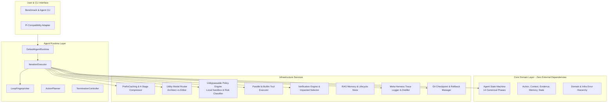
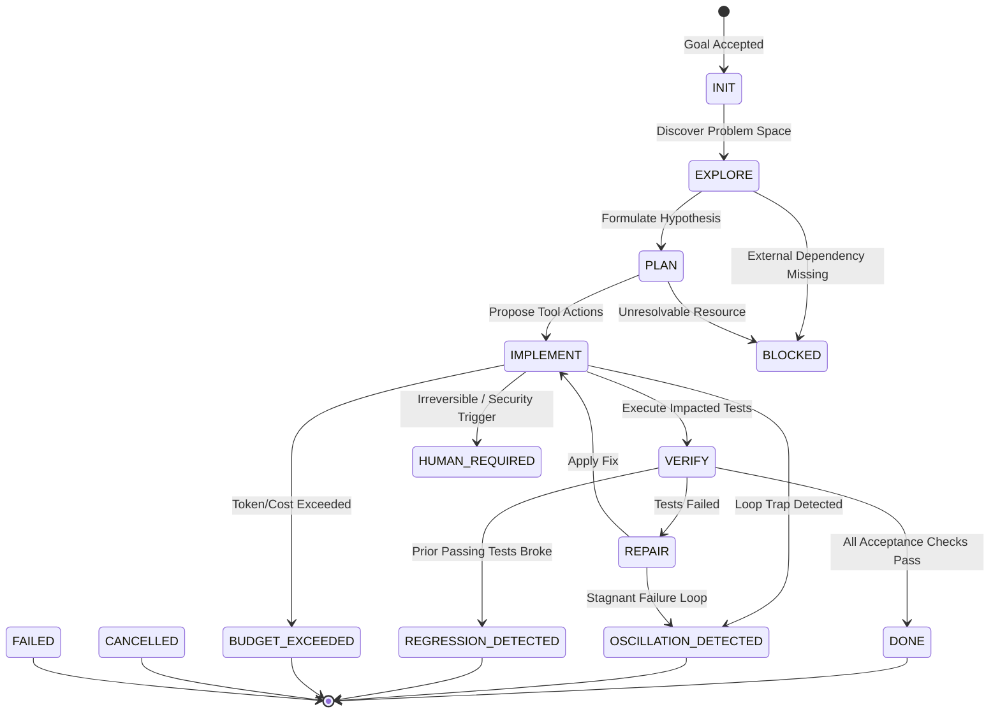
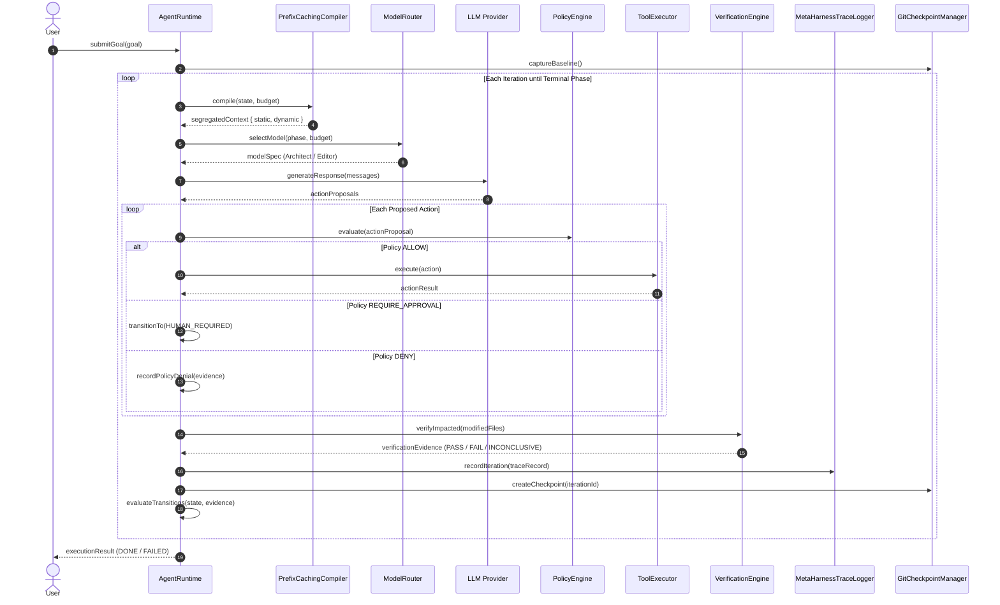

# Vi-Harness: Current Architecture Specification

## 1. Architectural Philosophy

Vi-Harness is built on the foundational thesis:
> **"The agent is not a persistent conversation. The agent is a stateful, evidence-driven state machine."**

Conversations degrade with horizon length due to context window saturation, attention dilution, and the "lost-in-the-middle" effect. Vi-Harness replaces unbounded conversational transcripts with an evidence-driven finite state machine operating over four distinct context tiers.

---

## 2. High-Level System Architecture

---

## 3. The 14 Canonical Agent Phases

---

## 4. The Four-Tier Context Model (L0 - L3)

| Tier | Name | Persistence | Typical Token Budget | Contents |
| :--- | :--- | :--- | :--- | :--- |
| **L0** | **Hot State** | Current Turn | 35-45% | Active goal, modified file buffers, immediate error stack traces, compiler output. |
| **L1** | **Working Memory** | Active Task | 20-30% | Execution plan checklist, current working hypothesis, recent decision records. |
| **L2** | **Episodic History** | Session | 10-15% | Condensed prior attempts, failed tool invocations, summarized branch outcomes. |
| **L3** | **Repository Knowledge** | Permanent | 20-40% | Coding standards, architectural rules, AST Repo-Map symbol graph. |

---

## 5. End-to-End Execution Sequence

