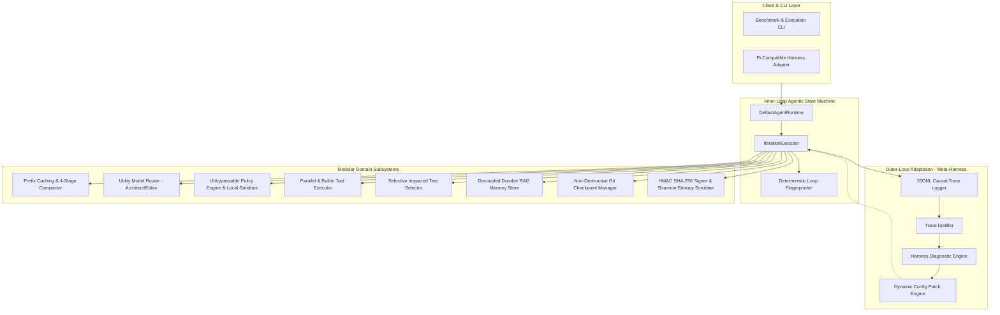

# Vi-Harness: Target Architecture Specification

## 1. Target Architecture Overview

The target state of Vi-Harness unites the **evidence-driven state machine** with **outer-loop automated adaptation (Meta-Harness)**, **progressive context compaction (Claude Code)**, and **cryptographic audit trails (Zero-Trust Enterprise)**.

---

## 2. Key Architecture Invariants

1. **The Model Proposes, The Runtime Decides**:
   The LLM never directly executes commands, transitions state, or creates Git commits. All proposals pass through deterministic verification and policy evaluation.
2. **Sublinear Context Invariant**:
   Context size across long horizons ($N \ge 100$ iterations) is bounded by $O(\log N)$ or constant bounds, preventing linear token explosion and cost runaway.
3. **Evidence-Driven DONE Gate**:
   A task may transition to `AgentPhase.DONE` if and only if empirical verification evidence (test pass, typecheck pass, lint pass) exists and has been validated by `AcceptanceEvaluator`.
4. **Zero-Loss User Rollback**:
   Agent rollbacks revert only agent-owned file modifications, preserving any uncommitted user work present prior to agent invocation.
5. **Cryptographic Tamper-Proof Audit**:
   Every state checkpoint, journal entry, and execution trace is signed with HMAC SHA-256 to ensure enterprise compliance and forensic auditability.
