# Vi-Harness: Enterprise Threat Model & Security Specification

## 1. Trust Boundaries & Actor Model

```mermaid
flowchart LR
    subgraph Untrusted [Untrusted Boundary]
        ModelOutput[LLM Output / Tool Proposals]
        UserWorkspace[Target Workspace Files]
        ExternalLogs[Third-Party Logs & Stderr]
    end

    subgraph Defense [Security Perimeter]
        RiskClassifier[RiskClassifier]
        PolicyEngine[Unbypassable PolicyEngine]
        SecretScrubber[SecretScrubber & Entropy Analyzer]
        PathValidator[Canonical PathValidator]
        CommandSanitizer[CommandSanitizer]
        AuditSigner[HMAC SHA-256 Signer]
    end

    subgraph Trusted [Trusted Runtime Core]
        ExecutionJournal[Cryptographic Execution Journal]
        StateStore[Verified State Store]
        ToolExecutor[Sandbox Tool Executor]
    end

    Untrusted --> Defense
    Defense --> Trusted
```

---

## 2. STRIDE & OWASP LLM Threat Analysis

| Threat Category | Attack Vector | Vi-Harness Mitigation Engine | Verification Test |
| :--- | :--- | :--- | :--- |
| **Prompt Injection & Overrides** | Malicious text in files attempting to alter agent instructions | Context Sanitizer strips `<system_override>` tokens; Policy Engine evaluates actions independently of prompt claims. | `tests/unit/security/red-team-suite.test.ts` |
| **Arbitrary Command Execution** | LLM proposes `rm -rf /` or chained commands `cat file; sudo reboot` | `CommandSanitizer` and `CommandRestrictionRule` reject chained operators (`;`, `&&`, `|`) and enforce strict command allowlists. | `tests/unit/security/red-team-suite.test.ts` |
| **Path Traversal & Escape** | LLM attempts `../../etc/passwd` or `C:/Windows/System32` | `PathValidator` resolves real canonical paths, rejecting any path outside the authorized workspace root. | `tests/unit/security/red-team-suite.test.ts` |
| **Credential & Secret Exposure** | Tool outputs containing AWS keys, GitHub tokens, or private RSA keys | `SecretScrubber` applies regex scrubbing and Shannon entropy ($-\sum p_i \log_2 p_i \ge 4.5$) redaction before logging or context injection. | `tests/unit/security/audit-integrity-signer.test.ts` |
| **Log Tampering & Repudiation** | Malicious insider modifying execution logs or checkpoint manifests | `AuditIntegritySigner` signs all journal entries and checkpoint manifests with HMAC SHA-256. | `tests/unit/security/audit-integrity-signer.test.ts` |
| **Excessive Agency & Unbounded Loops** | Infinite recursive self-invocation or stagnation loops | `LoopFingerprinter` detects SHA-256 state repetition; `DefaultSubagentManager` enforces max depth $\le 3$. | `tests/unit/runtime/loop-fingerprinter.test.ts` |
| **Production Environment Impact** | Accidental deployment or modification of production targets | `ProductionProtectionRule` rejects or escalates any action referencing `/prod/i` or `environment: 'PRODUCTION'`. | `tests/unit/security/final-security-audit.test.ts` |
