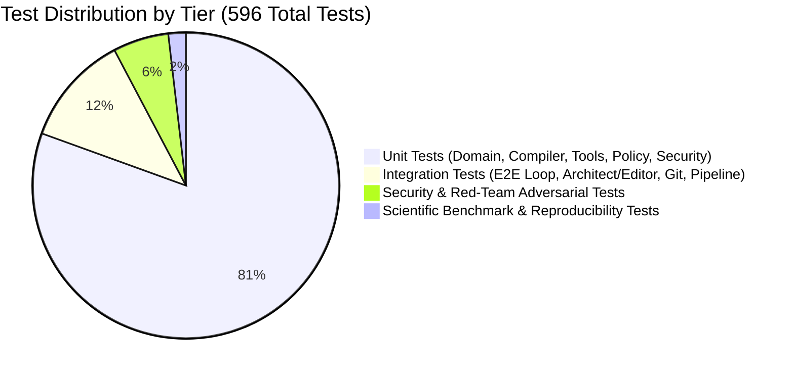

# Vi-Harness: Comprehensive Test Strategy

## 1. Test Pyramid & Verification Hierarchy

Vi-Harness employs a multi-tier testing strategy designed to verify functional correctness, state-machine transitions, context efficiency, security boundaries, and benchmark reproducibility.

---

## 2. Test Layer Specifications

### 2.1. Layer 1: Unit Tests (`tests/unit/`)
- **Scope**: Fast, isolated verification of individual classes, pure functions, algorithms, and domain models.
- **Network & I/O Isolation**: Zero real network calls. Uses `TestClock`, `MockModelProvider`, `ScriptedModelProvider`, and in-memory stores.
- **Key Suites**:
  - `core/state-machine-hardening.test.ts` (77 tests): Exhaustive matrix of valid/invalid phase transitions.
  - `compiler/context-budget-balancer.test.ts`: Phase-adaptive token allocation ratios.
  - `compiler/prefix-caching-compiler.test.ts`: Static/dynamic prefix caching header verification.
  - `runtime/loop-fingerprinter.test.ts`: Stagnation ($A \to A$) and oscillation ($A \to B \to A$) detection.
  - `security/audit-integrity-signer.test.ts`: HMAC SHA-256 tamper-proofing and Shannon entropy redaction.

### 2.2. Layer 2: Integration Tests (`tests/integration/`)
- **Scope**: End-to-end multi-turn execution flows connecting multiple real subsystems.
- **Key Suites**:
  - `meta-harness-production-flow.test.ts`: Multi-step flow with prefix caching, trace logging, and impacted test selection.
  - `git-real-repository.test.ts`: Real Git worktree manipulation, checkpoint creation, and user edit preservation.
  - `verification-pipeline.test.ts`: Real process execution, TypeScript compilation, and exit-code evaluation.
  - `enterprise-readiness-suite.test.ts`: Full enterprise workflow combining cryptographic audit, causal diagnostics, and streaming tool parsing.

### 2.3. Layer 3: Security & Adversarial Red Team (`tests/unit/security/`)
- **Scope**: Active penetration and exploit simulation.
- **Key Suites**:
  - `red-team-suite.test.ts` (16 tests): Path traversal (`../../etc/passwd`), command injection (`cat file; rm -rf /`), secret exposure, permission escalation, and approval spoofing.
  - `final-security-audit.test.ts`: Production environment boundary enforcement.

### 2.4. Layer 4: Scientific Benchmark & Reproducibility (`src/cli/`)
- **Scope**: Comparative statistical benchmarks across Pi vs Vi-Harness.
- **Commands**:
  - `npm run benchmark:context`: Measures token scaling across 10, 25, 50, and 100 iteration horizons.
  - `npm run benchmark`: Runs canonical task evaluation suite across isolated trial workspaces.
